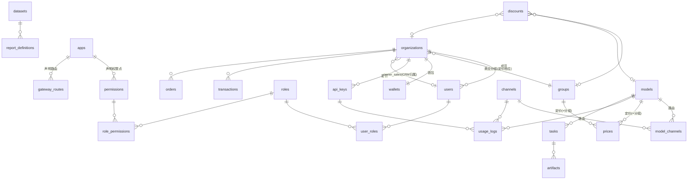

# Rise Router 核心数据模型设计（任务 A）

> 版本：v0.1 · 2026-06-13 · 数据库锁定 PostgreSQL · ORM 主用 SeaORM 2.0
> 本文是建表前的领域模型蓝图。所有表隐含 `id`(bigint/uuid)、`created_at`、`updated_at`、软删除 `deleted_at`（除流水类只追加表外），下文不再逐一列出。

## 0. 设计基准：对 new-api 的结构性改进

调研结论（一手来自本地 `new-api/model/`，旁参 LiteLLM / Portkey）：

| new-api 的做法 | 痛点 | rise-router 的改法 |
|---|---|---|
| 倍率存 `options` 表的 JSON 大字段（`ModelRatio`/`GroupRatio`/`CompletionRatio`/`GroupGroupRatio`…），启动加载进内存 map | 非范式化、无约束、无法事务化批量改、无版本/审计、无法按维度查询 | **价格独立成关系表 `prices`**，按 (模型 × 分组) 行级存储，带生效期与版本 |
| 计费 = `ModelRatio × GroupRatio × CompletionRatio × GroupGroupRatio` 链式相乘 | 管理员要心算、语义隐晦、改一处影响全局 | **显式单价**（元/百万 token 等直观单位）+ **独立折扣表**，最终价 = 查表 + 显式折扣，规则可见 |
| `User` 既是登录主体又是计费主体，`Group` 字段直接挂用户 | to-C 模型，企业多用户/多密钥/统一账户难表达 | **Organization 为计费主体**（钱包/分组挂这里），User 为成员，ApiKey 为虚拟密钥（借鉴 LiteLLM/Portkey org→member→key） |
| 倍率层即路由层（`abilities` 带 group） | 定价与路由耦合 | **路由（model↔channel）与定价（model×group→价）彻底分离** |
| Midjourney/Suno 任务为补丁式专表 | 多模态非一等公民 | **统一 `tasks` + `artifacts`**，模型用 `modality × invocation` 两维度建模 |

**关键澄清——两条独立的"分组"轴，不要混淆：**
- **Role（角色）** = RBAC 能力束（customer / sales / finance / ops / admin）→ 决定**能做什么**。
- **Group（用户分组）** = 商业定价档位（default / vip / enterprise）→ 决定**付多少钱**，是定价五要素之一。
- 一个用户同时拥有 Role（挂 user）和 Group（挂 organization）。二者正交。

---

## 1. 身份与组织域（Identity）

### `organizations` — 账户与计费主体
| 字段 | 类型 | 说明 |
|---|---|---|
| name | varchar(128) | 组织/客户名 |
| type | smallint | 1=个人(self-register 自动建的 org-of-one) 2=企业 |
| group_id | bigint FK→groups | **商业分组（定价档位）挂在组织上**，定价五要素之一 |
| status | smallint | 1=正常 2=停用 |
| realname_status | smallint | 实名认证状态：0=未认证 1=个人已认证 2=企业已认证（国情合规） |
| owner_sales_id | bigint FK→users | 归属销售（CRM，可空；自主注册为空） |

> 个人自主注册 = 自动创建一个 `type=个人` 的 org-of-one，统一计费/钱包模型，避免双套逻辑。

### `users` — 登录主体（组织成员）
| 字段 | 类型 | 说明 |
|---|---|---|
| org_id | bigint FK→organizations | 所属组织 |
| phone | varchar(20) | **手机号（国情主注册通道）**，唯一 |
| email | varchar(128) | 可选 |
| password_hash | varchar(255) | argon2/bcrypt |
| nickname | varchar(64) | |
| status | smallint | 1=启用 2=禁用 |
| last_login_at | timestamptz | |

> 第三方登录（微信等）走 `user_identities(user_id, provider, external_id)` 旁表，不污染主表。

### `groups` — 用户分组（定价五要素①·纯分类）
| 字段 | 类型 | 说明 |
|---|---|---|
| slug | varchar(64) | default / vip / enterprise，唯一 |
| name | varchar(128) | 展示名 |
| description | text | |

> **`groups` 表本身不含任何价格字段。** 它只是分类标签；价格在 `prices` 引用它，折扣在 `discounts` 引用它。

---

## 2. 认证与权限域（RBAC）

平台自身是 OIDC Provider；权限点由 App 注册时声明（见 App 域）。

### `roles` — 角色
| 字段 | 类型 | 说明 |
|---|---|---|
| slug | varchar(64) | customer/sales/finance/ops/admin，唯一 |
| name | varchar(128) | |
| is_builtin | bool | 内置角色不可删 |

### `permissions` — 权限点（由 App 声明注入）
| 字段 | 类型 | 说明 |
|---|---|---|
| code | varchar(128) | 如 `pricing.write`、`ticket.read`、`report.dataset.finance`，唯一 |
| app_id | bigint FK→apps | 来源 App（内部模块也是 App，狗粮原则） |
| description | text | |

### `role_permissions` — 角色↔权限点（M:N）
`(role_id, permission_id)` 联合主键。

### `user_roles` — 用户↔角色（M:N，可带数据域 scope）
| 字段 | 类型 | 说明 |
|---|---|---|
| user_id | bigint FK | |
| role_id | bigint FK | |
| scope | jsonb | 可选数据域限定（如某销售只管某些客户），供报表 RLS 取用 |

---

## 3. 应用注册域（App Registry，平台可插拔核心）

### `apps` — 应用（内部模块 + 第三方系统统一）
| 字段 | 类型 | 说明 |
|---|---|---|
| slug | varchar(64) | ticket-system / crm / pricing-admin，唯一 |
| name | varchar(128) | |
| kind | smallint | 1=内部模块(编译进主二进制) 2=第三方(独立进程) |
| owner_org_id | bigint FK→organizations | 第三方 App 所属组织（内部模块为空） |
| manifest | jsonb | App Manifest 全文（auth/permissions/api_routes/frontend 四要素） |
| status | smallint | 1=启用 2=停用 |

> manifest 中的 `permissions` 在注册时落地到 `permissions` 表；`api_routes` 落地到 `gateway_routes`；`frontend.menus` 供前端 Shell 拉取渲染。manifest 为唯一事实源，落地表为派生缓存。

### `api_keys` — 虚拟密钥（借鉴 LiteLLM virtual key）
| 字段 | 类型 | 说明 |
|---|---|---|
| org_id | bigint FK→organizations | 计费归属 |
| user_id | bigint FK→users | 可空（个人密钥） |
| app_id | bigint FK→apps | 可空（App 专用密钥，用量账单挂 App） |
| key_hash | varchar(255) | 仅存哈希，唯一索引 |
| name | varchar(128) | |
| allowed_models | jsonb | 可空=不限；模型白名单 |
| budget_limit | numeric(18,6) | 可空=不限；密钥级预算（命中返回 429） |
| budget_used | numeric(18,6) | |
| expires_at | timestamptz | 可空=永不过期 |
| status | smallint | 1=启用 2=禁用 3=耗尽 |

---

## 4. 网关与路由域（Gateway / Relay）

### `models` — 模型能力目录（定价五要素②·纯能力，无价格）
| 字段 | 类型 | 说明 |
|---|---|---|
| slug | varchar(128) | 对外模型名 `gpt-4o` / `kling-v2`，唯一 |
| display_name | varchar(128) | |
| modality | varchar(32) | chat / embedding / image / video / audio / rerank |
| invocation | varchar(16) | `sync_stream` / `async_task` |
| billing_unit | varchar(16) | 计费计量单位：token / image / second / call（价值在 prices 表，这里只声明量纲） |
| capabilities | jsonb | vision/function_calling/reasoning/context_window/max_output… (借鉴 LiteLLM ModelSpec) |
| status | smallint | 1=上架 2=下架 |

### `channels` — 上游渠道（定价五要素③相关·纯接入，成本与售价分离）
| 字段 | 类型 | 说明 |
|---|---|---|
| name | varchar(128) | |
| protocol_adapter | varchar(64) | **协议族**：`openai_compatible`/`anthropic`/`gemini`/`task_kling`… 新厂商属已知协议族=纯配置接入 |
| base_url | varchar(255) | |
| credentials | jsonb(加密) | 密钥/多 key 轮询配置 |
| adapter_config | jsonb | 协议族内消化厂商 quirk 的配置开关 |
| priority | int | 路由优先级 |
| weight | int | 同优先级内加权随机 |
| rate_limit | jsonb | 渠道级限流 |
| status | smallint | 1=启用 2=手动禁用 3=自动熔断 |

### `model_channels` — 路由表（Ability，model↔channel，借鉴 new-api 但剥离 group/价格）
| 字段 | 类型 | 说明 |
|---|---|---|
| model_id | bigint FK→models | |
| channel_id | bigint FK→channels | |
| upstream_model_name | varchar(128) | 上游真实模型名（模型映射） |
| cost_price | jsonb | **渠道成本价**（按 billing_unit），用于财务毛利报表，与售价分离 |
| enabled | bool | |
| priority | int | 覆盖渠道默认优先级（可空） |
| weight | int | |

> 联合唯一 `(model_id, channel_id)`；路由查询索引 `(model_id, enabled, priority, weight)`。
> **可选的分组级路由**（"vip 分组优先走优质渠道"）通过 `channels` 上的 `allowed_groups jsonb` 限定，不下沉到本表，保持路由与分组弱耦合。

**路由解析流程**：`给定 model_slug → 查 models → 查 model_channels(enabled, 按 priority 降序) → 同优先级按 weight 加权随机选 channel → 故障转移到次优先级`。全程不碰价格。

---

## 5. 定价域（五要素解耦的核心）

### `prices` — 价格表（定价五要素④·显式单价）
| 字段 | 类型 | 说明 |
|---|---|---|
| model_id | bigint FK→models | |
| group_id | bigint FK→groups | **可空 = 该模型对所有分组的默认价**；非空 = 特定分组专属价 |
| billing_unit | varchar(16) | 与 model.billing_unit 一致 |
| currency | varchar(8) | 默认 CNY |
| unit_prices | jsonb | 按量纲存显式单价，见下 |
| valid_from | timestamptz | 生效期（版本化，改价不覆盖历史） |
| valid_to | timestamptz | 可空=长期有效 |
| version | int | 价格版本号 |

`unit_prices` 结构按 `billing_unit` 区分（**直观单位，无倍率**）：
```jsonc
// token 类（元/百万 token）
{ "input": 5.0, "output": 15.0, "cache_read": 0.5 }
// image 类（元/张，按分辨率分档）
{ "tiers": [ {"resolution":"1024x1024","price":0.20}, {"resolution":"1792x1024","price":0.40} ] }
// video 类（元/秒，按分辨率分档）
{ "tiers": [ {"resolution":"720p","price":0.5}, {"resolution":"1080p","price":1.0} ] }
// call 类（元/次）
{ "per_call": 0.1 }
```
> 联合查询索引 `(model_id, group_id, valid_from)`。一次 `WHERE model_id=? AND (group_id=? OR group_id IS NULL) ORDER BY group_id NULLS LAST, version DESC LIMIT 1` 即得**该分组该模型的确定单价**——满足"管理员任意页面直接看到分组×模型最终单价"。

### `discounts` — 折扣表（定价五要素⑤·独立、显式、可叠加）
| 字段 | 类型 | 说明 |
|---|---|---|
| name | varchar(128) | |
| scope | varchar(16) | `global`/`group`/`model`/`org`（按客户）/`model_group` |
| target_org_id | bigint FK | scope=org 时 |
| target_group_id | bigint FK | scope=group 时 |
| target_model_id | bigint FK | scope=model 时 |
| kind | varchar(16) | `percentage`（打折）/ `fixed`（减额）|
| value | numeric(10,4) | 0.9=九折 或 减免金额 |
| stackable | bool | 是否可与其他折扣叠加 |
| priority | int | 不可叠加时取优先级最高的一条 |
| valid_from / valid_to | timestamptz | 时段折扣 |

**最终价解析流程（显式，无隐藏相乘）：**
```
1. base = prices.lookup(model, org.group)        // 一次查表得确定单价
2. ds   = discounts.applicable(org, model, group, now)  // 显式列出所有命中折扣
3. final = apply(base, ds)                        // 叠加规则可见（stackable/priority）
4. 管理台「价格预览」页同样调此函数 → 所见即所得
```
对比 new-api 的 `ModelRatio×GroupRatio×CompletionRatio×GroupGroupRatio`：本设计**改任一要素不联动其余四个**，且每一步都可在 UI 展开。

---

## 6. 计费与财务域（Billing / Finance）

### `wallets` — 账户钱包（挂组织）
| 字段 | 类型 | 说明 |
|---|---|---|
| org_id | bigint FK→organizations | 唯一 |
| balance | numeric(18,6) | 余额（CNY） |
| credit_limit | numeric(18,6) | 授信额度（企业后付费） |
| frozen | numeric(18,6) | 预扣冻结额 |

### `usage_logs` — 调用计费流水（只追加，对应 new-api logs）
| 字段 | 类型 | 说明 |
|---|---|---|
| org_id / user_id / api_key_id / app_id | bigint | 多维归属 |
| model_id / channel_id | bigint | |
| group_slug | varchar(64) | **计费时快照分组**（落库当下的 org.group，事后改分组不影响历史账；规避 riseapi-ops 记录的 Token-group/User-group 优先级歧义踩坑）|
| request_id | varchar(64) | |
| billing_unit | varchar(16) | |
| quantity | jsonb | 用量（{input,output} 或 {seconds,resolution} 等） |
| base_amount | numeric(18,6) | 折前金额 |
| discount_detail | jsonb | 命中折扣明细（可追溯） |
| charged_amount | numeric(18,6) | 实扣金额 |
| cost_amount | numeric(18,6) | 渠道成本（毛利报表用） |
| latency_ms | int | |
| is_stream | bool | |
| created_at | timestamptz | 索引 `(org_id, created_at)`、`(created_at)` |

### `transactions` — 资金流水（充值/消费/退款/调整，只追加）
| 字段 | 类型 | 说明 |
|---|---|---|
| org_id | bigint FK | |
| type | smallint | 1=充值 2=消费 3=退款 4=调整 5=授信还款 |
| amount | numeric(18,6) | 正负 |
| balance_after | numeric(18,6) | 快照 |
| ref_type / ref_id | | 关联 order/usage_log 等 |

### `orders` — 充值/订阅订单
| 字段 | 类型 | 说明 |
|---|---|---|
| org_id | bigint FK | |
| created_by_sales_id | bigint FK→users | **销售代客下单**（双获客通道之一），可空 |
| amount | numeric(18,6) | |
| pay_channel | varchar(32) | wechat/alipay/bank_transfer（国情支付） |
| trade_no | varchar(128) | 第三方支付单号，唯一 |
| status | smallint | pending/paid/failed/refunded |
| invoice_id | bigint FK→invoices | 可空 |

### `invoices` — 发票（企业财务）
精简：`org_id, title, tax_no, amount, type(普票/专票), status`。

### `reconciliations` — 对账单（借鉴 agent-console / april_reconcile_report）
| 字段 | 类型 | 说明 |
|---|---|---|
| period | varchar(16) | 对账周期，如 `2026-06` |
| status | smallint | 1=draft 2=locked（锁定后才允许人工调整明细） |
| total_revenue | numeric(18,6) | 应收（按 usage_logs.charged_amount 聚合） |
| upstream_cost | numeric(18,6) | 实付上游（按 usage_logs.cost_amount 聚合） |
| gap | numeric(18,6) | 差额（应收−成本=毛利；与外部账单核对的 gap） |
| detail | jsonb | 模型级对账明细 |

> 价格版本对账复用 `prices.version`，无需额外快照表。

---

## 7. 多模态任务域（Task）

### `tasks` — 异步任务（统一 /v1/tasks 的持久化）
| 字段 | 类型 | 说明 |
|---|---|---|
| public_id | varchar(64) | 对外 `task_xxx`，唯一 |
| org_id / user_id / api_key_id | bigint | |
| model_id / channel_id | bigint | |
| type | varchar(48) | `video.generation`/`image.generation`… |
| status | varchar(16) | queued/running/succeeded/failed/cancelled（状态机）|
| input | jsonb | 标准入参 |
| extra | jsonb | 厂商独有参数透传 |
| upstream_task_id | varchar(128) | 上游任务 ID |
| webhook_url | varchar(255) | 回调地址 |
| progress | smallint | 0–100 |
| error | jsonb | 失败详情 |
| usage_log_id | bigint FK | 结算后回填 |
| submitted_at / finished_at | timestamptz | 索引 `(status, submitted_at)` |

### `artifacts` — 任务产物
| 字段 | 类型 | 说明 |
|---|---|---|
| task_id | bigint FK→tasks | |
| storage_url | varchar(512) | S3 兼容对象存储（MinIO/OSS/COS 可插拔）|
| content_type | varchar(64) | video/mp4 等 |
| size_bytes | bigint | |
| expires_at | timestamptz | 临时链接过期 |

---

## 8. CRM / 销售域（轻量起步）

- `organizations.owner_sales_id` 已表达客户归属；`orders.created_by_sales_id` 表达销售代客充值。
- `customer_notes(org_id, author_id, content, created_at)` — 跟进记录。
- `customer_assignments(org_id, sales_id, assigned_at, active)` — 归属变更历史（业绩归因）。
- 销售业绩 = 报表域基于 `orders`/`usage_logs` 按 `owner_sales_id` 聚合，不另建汇总表（按需迭代）。

---

## 9. 监控报表域（语义层 + RLS）

### `datasets` — 策展数据集（管理员定义，不开放原始库）
| 字段 | 类型 | 说明 |
|---|---|---|
| slug | varchar(64) | usage / revenue / channel_health… |
| name | varchar(128) | |
| source_view | varchar(128) | 后端策展视图/查询模板名（白名单） |
| metrics | jsonb | 可用指标定义 |
| dimensions | jsonb | 可用维度定义 |
| rls_rule | jsonb | 行级安全规则，如 `{"customer":"org_id = :current_org","sales":"owner_sales_id = :current_user"}` |
| required_permission | varchar(128) | 访问所需权限点 |

### `report_definitions` — 用户保存的定制报表
| 字段 | 类型 | 说明 |
|---|---|---|
| owner_user_id | bigint FK | |
| dataset_id | bigint FK→datasets | 只能基于数据集 |
| config | jsonb | 选中的指标/维度/过滤/图表类型/刷新周期 |
| visibility | varchar(16) | private/role/org |
| schedule | jsonb | 可空；定时导出/订阅（Excel/PDF/webhook/邮件）|

> 查询引擎在执行时按当前用户角色注入 `rls_rule` 对应分支，强制行级过滤，用户无法绕过。

---

## 10. 客服域（轻量起步，后续迭代）

`tickets(org_id, created_by, assignee_id, subject, status, priority, channel)` + `ticket_messages(ticket_id, sender_id, sender_type, body, created_at)`。会话式客服与工单共用此骨架，复杂能力按实际痛点再加。

---

## 10.5 跨域审计（借鉴 apikey_approval / agent-console）

### `audit_logs` — HTTP 级审计（只追加）
| 字段 | 类型 | 说明 |
|---|---|---|
| caller_id | bigint | 操作者（user/app/service token）|
| method | varchar(8) | HTTP 方法 |
| path | varchar(255) | 请求路径 |
| status_code | smallint | 响应码 |
| request_id | varchar(64) | 链路追踪 ID |
| body_digest | varchar(128) | 请求体摘要（非全文，避免存敏感数据）|
| error_msg | text | 可空 |
| created_at | timestamptz | 索引 `(caller_id, created_at)`、`(path, created_at)` |

### `*_events` — 业务事件流（只追加，状态机审计）
订单、审批、密钥申请等带状态机的实体共用此模式（如 `order_events`），记录每次状态变更，使流程可追溯：
| 字段 | 类型 | 说明 |
|---|---|---|
| ref_id | bigint | 关联实体 ID（如 order_id）|
| event_type | varchar(48) | 事件类型/目标状态 |
| operator_id | bigint | 操作者 |
| payload | jsonb | 变更详情 |
| created_at | timestamptz | |

> 带状态机的工作流（订单/审批/密钥）遵循借鉴自 `apikey_approval` 的统一模式：唯一业务键幂等（如 `trade_no`/`ticket_no`）+ 行锁并发控制 + append-only 事件流 + cron 对账重放修复漂移。

---

## 11. 核心 ER 关系图（定价 + 路由 + 计费主干）



**两条解耦主线（本设计的灵魂）：**
1. **路由线**：`models —< model_channels >— channels`（谁能服务这个模型、怎么转发）——只管能力可达与负载。
2. **定价线**：`models —< prices >— groups` + `discounts`（这个分组用这个模型多少钱）——只管价格。
   两线在 `models` 处相交，但**互不依赖**：改渠道不动价，改价不动路由，改分组不动模型，改折扣不动其余四要素。

---

## 12. SeaORM / 工程落地提示

- 每个域 = 一个 SeaORM entity 模块；建议按域拆 crate（`identity`/`rbac`/`gateway`/`pricing`/`billing`/`task`/`report`），与微内核 crate 切分对齐。
- 价格解析、路由解析各封装为独立 service 函数（纯函数 + 一次查表），供网关热路径与管理台「价格预览」复用——同一函数保证所见即所得。
- 流水类表（`usage_logs`/`transactions`/`tasks`）只追加、按时间建索引；量级上去后再评估分区或迁 TimescaleDB（不提前做）。
- `manifest`→派生表（permissions/gateway_routes/menus）的同步逻辑做成幂等 upsert，App 注册/更新时重放。

## 参考来源
- 本地 `new-api/model/`（一手：abilities 路由表、logs 计费流水、tasks 异步任务、options-JSON 倍率体系的繁琐根因）
- [LiteLLM Model Catalog / ModelSpec](https://deepwiki.com/BerriAI/litellm/2.6-cost-calculation-and-model-pricing)（capabilities 标签、虚拟密钥预算）
- [LiteLLM virtual keys & budgets](https://blog.elest.io/litellm-stop-burning-money-on-llm-apis-virtual-keys-cost-tracking-and-guardrails/)
- [Portkey vs LiteLLM 多租户 org→team→key](https://portkey.ai/lp/portkey-vs-litellm)
