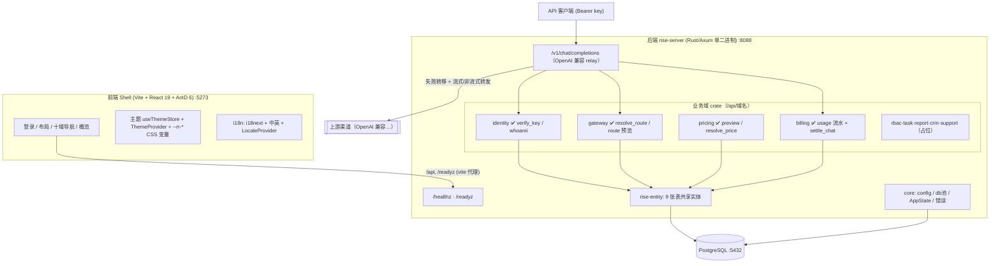
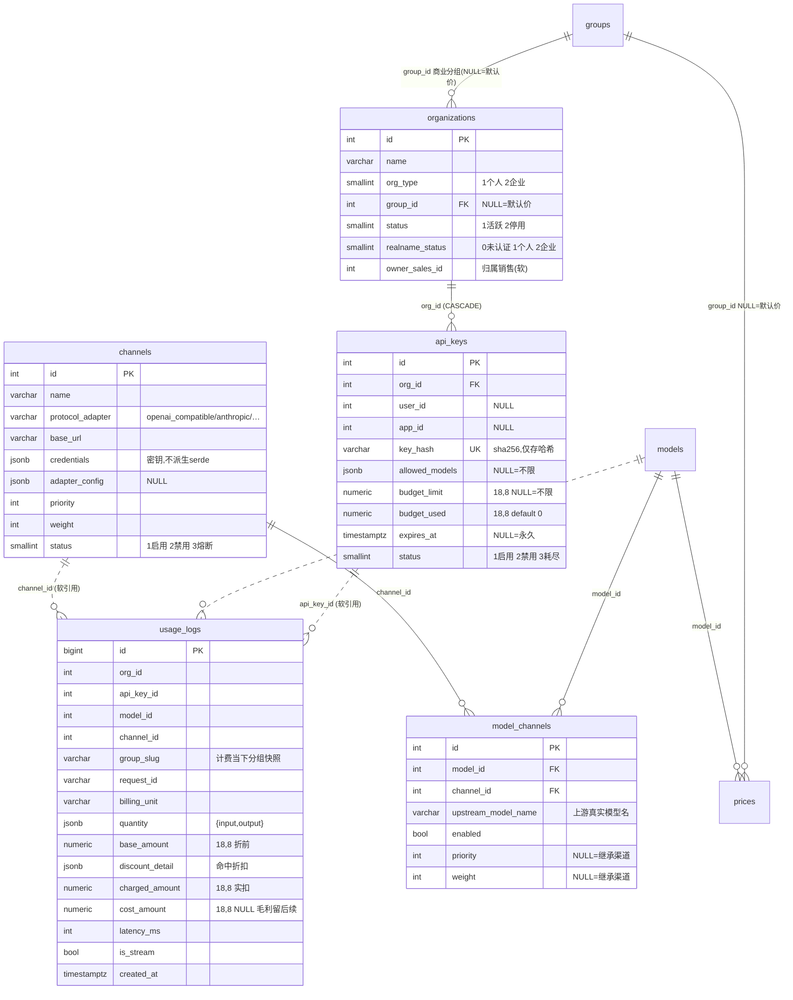
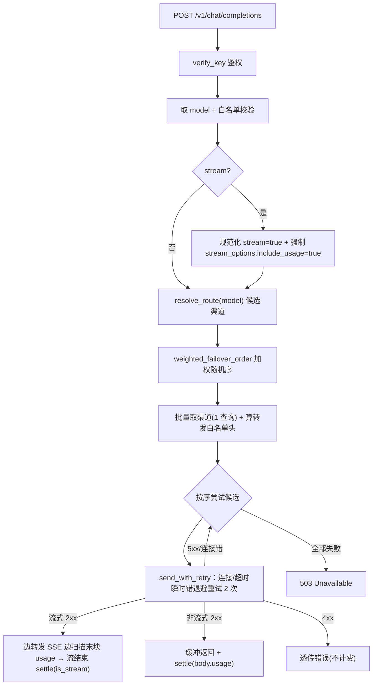
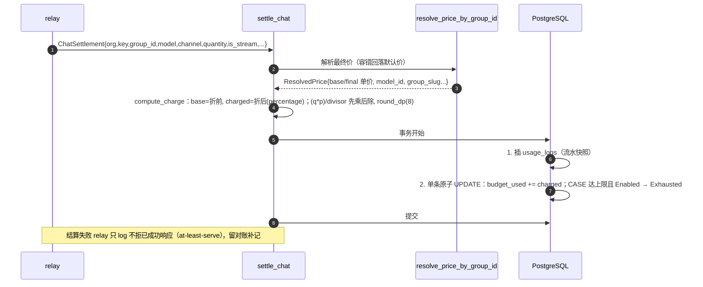

# Rise Router 已实现功能与数据库设计（as-built）

> 版本：v0.11 · 2026-06-19 · 本文记录**已落地的真实实现状态**（与设计蓝图 [data-model.md](./data-model.md)/[architecture.md](./architecture.md) 区分）。表结构取自运行库真实 schema。
>
> v0.11 增量（分支 `feat/m4-report-slice-c`）：⑨ **M4 报表 片C —— 前端报表构建器（纯前端，零后端改动）**。对接片A/B 已冻结的策展数据集 + RLS 查询 API：**报表构建器**（`/report`，选数据集 → 选指标/维度/时间窗/行数上限 → 查询 → recharts 柱/折线图 + AntD 表格双渲染 + RLS 角色徽标）+ **报表定义保存/加载/删除**（`已存报表` 抽屉，config 存 `report_definitions.config` jsonb）。新增依赖 **recharts ^2.15**（轻量，bundle gzip 515→633kB）+ `src/api/report.ts` + `src/pages/report/ReportBuilder.tsx`。RLS 行级隔离仍由后端引擎强制（前端无法绕过）。`tsc` + `vite build` 绿。详见 §17。
>
> v0.10 增量（分支 `feat/m3-crm-slice-d`）：⑧ **M3 CRM 片D —— 前端 CRM 控制台（纯前端，零后端改动）**。对接片A/B 已落地端点：**客户列表页**（`/crm`，游标分页 + 按归属销售 id 过滤 + 「代客开户」弹窗）+ **客户详情页**（`/crm/:orgId`，钱包余额/授信/冻结卡片 + 「代客充值」「改派归属」弹窗 + Tabs 跟进记录/归属历史）。新增 `src/api/crm.ts`（类型化封装，Decimal 按字符串、枚举按变体名）+ `src/pages/crm/{CustomerList,CustomerDetail,labels}`。数据域隔离仍由后端 `require_scoped` 强制（前端无法绕过；越域 404）。归属销售/改派目标用 number 输入（无 users 列表端点，避免为 FK 下拉新建端点）。`tsc` + `vite build` 绿。详见 §16。
>
> v0.9 增量（分支 `feat/m4-report-slice-b`）：⑨ **M4 报表 片B —— 业绩/账单/运维数据集（零引擎改动）**。验证 片A 契约：仅加 source 注册 + seed，引擎/表零改。新增 1 个共享 source `orders`（账单+业绩复用：dims status/pay_channel/created_by_sales_id/org_id/day；mets order_count/order_amount/paid_amount(filter status=2 Paid)/paid_count/customer_count）+ 给 `usage` source 补 `p95_latency`(percentile_cont)/`stream_ratio`；新增 3 数据集 seed：`billing`（customer→org_id / finance·admin 全量）、`sales_perf`（sales→created_by_sales_id / finance·admin 全量，perm=report.dataset.crm）、`channel_health`（ops·admin only，不暴露 revenue，perm=report.dataset.ops）。smoke 扩至 **23/23**（含三新数据集 RLS + 列表权限过滤）。缺口：运维错误率/成本/任务队列待 片E 埋点。详见 §15.7。
>
> v0.8 增量（分支 `feat/m4-report-slice-a`）：⑨ **M4 监控报表 片A 内核** —— 策展语义层「**不开放原始库**」落地：新增 `datasets`（source 白名单 + 策展 metrics/dimensions + 按角色 `rls_rule`）/ `report_definitions`（只能基于数据集）两表；**RLS 行级隔离查询引擎**（`report/src/engine.rs`）复用 RBAC 与新增 `rise_identity::Principal`（有效角色 + org/user + 权限集），安全三步：权限门禁 → 按角色取 `rls_rule` 分支（缺键=403 / null=全量 / {column,param}=绑定参数过滤）→ 仅拼装 source 白名单受控标识符 + 值一律绑定参数注入（无注入面）。新增 RBAC 权限点 `report.read`/`report.define`/`report.dataset.{finance,crm,ops}`/`report.export` + `effective_role`。内置「用量」数据集打通端到端（customer 仅见本组织 / finance·admin 全量 / sales 无分支 403）。狗粮：报表为内部一等 App，与第三方走同一数据集契约。15 项 smoke 全过（`scripts/smoke_report.sh`）。详见 §15。
>
> v0.7 增量（分支 `feat/m3-crm-slice-b`）：⑧ **M3 CRM 片B** —— 销售**代客开户**（事务建 org+user+首条 active 归属，客户后续手机号+短信登录）+ **代客充值**（一步直接 Paid 订单 + 入账，`orders.created_by_sales_id` 业绩归因）；复用片A `require_scoped` 数据域（销售仅给自己名下客户开户/充值）+ `billing::recharge_wallet`（同事务入账）；**零新表**（复用 orders/users/customer_assignments）。详见 §14.5。
>
> v0.6 增量（分支 `feat/m3-crm-foundation`）：⑧ **M3 CRM 片A** —— 客户档案（org + 钱包余额 + 归属销售）、跟进记录（`customer_notes`）、归属变更历史（`customer_assignments`：事务改派 + 业绩归因轨迹）。新增 RBAC 权限点 `crm.read`/`crm.read.all`/`crm.write`/`crm.assign` + **端点层数据域隔离**（销售仅见/操作自己名下客户，管理员/财务/超管令牌全量）。详见 §14。
>
> v0.5 增量（分支 `feat/m1-admin-crud`）：④ **用户注册登录**（手机号 + 短信验证码 + JWT 会话，自动建 org-of-one）；⑤ **RBAC**（roles/permissions/role_permissions/user_roles + `enforce` + 内置 seed），管理端点由临时 `X-Admin-Token` 收敛为 `require(perm)`（superadmin 令牌逃生通道 + 用户角色权限）+ 角色授予 API。详见 §9/§13。**M1（MVP）实质完成。**
>
> v0.4 增量：① 全套**管理台 CRUD**（8 实体 + 共享 admin 守卫）补齐 M1 退出标准的管理面；② **前端管理控制台**（数据驱动 CrudPage + 价格预览页）；③ 同步登记已合并的 **M2 财务**（钱包/订单/对账）端点与表。详见 §9/§12。

## 1. 本阶段已实现概览

| 模块 | 内容 | 位置 | 状态 |
|---|---|---|---|
| M0 脚手架 | Cargo workspace + 10 域 crate + Axum 单二进制 + `/healthz` `/readyz` + SeaORM 迁移 + 前端 Shell | `backend/`、`frontend/shell/` | ✅ main |
| 可配置主题 | 克制专业风、暗色优先+浅色、极光青绿、4 强调色预设、白标、自托管字体 | `frontend/shell/src/theme/` | ✅ main |
| 国际化 i18n | i18next + 中/英 + 语言切换 + AntD/dayjs 联动 + API 错误码映射 | `frontend/shell/src/i18n/` | ✅ main |
| **定价核心** | 五要素解耦：models/prices/discounts + `resolve_price()`（slug 版）/`resolve_price_by_group_id()`（热路径）+ 价格预览 | `backend/crates/{entity,pricing}` | ✅ main |
| **身份与密钥** | organizations + 虚拟密钥 api_keys + `verify_key()`（单 JOIN 鉴权）+ `bearer_token()` + `whoami` | `backend/crates/identity` | ✅ main |
| **网关与路由** | channels + model_channels + `resolve_route()`（路由线）+ `rank_routes`/加权随机序 + `/route` 预览 | `backend/crates/gateway` | ✅ main |
| **relay 转发** | OpenAI 兼容 `/v1/chat/completions`：鉴权→白名单→路由→失败转移→转发；**流式 SSE + 重试退避 + 转发头** | `backend/crates/gateway/src/relay.rs` | ✅ main(非流式) / 🔶 PR(流式) |
| **计费结算** | 同步后扣：`charge`（算费纯函数）+ `settle_chat`（事务：流水+扣预算）+ usage_logs + `/usage` 游标分页 | `backend/crates/billing` | ✅ main |
| **M2 财务** | 钱包（余额/授信/冻结）+ 充值入账 + 充值订单（mock 支付/幂等）+ 应收侧对账（周期聚合 + draft/locked 封账）| `backend/crates/billing` | ✅ main |
| **管理台 CRUD** | 五要素 + 路由 + 身份共 8 实体的增删改查（admin 守卫）：channels/models/model_channels/groups/prices/discounts/organizations/api_keys | `backend/crates/{gateway,pricing,identity}` | ✅ 本片 |
| **前端管理控制台** | 数据驱动 `CrudPage` + 字段描述符（8 实体）+ 价格预览页 + 管理令牌设置；`X-Admin-Token` 通道 | `frontend/shell/src/pages/admin/` | ✅ 本片 |
| **用户登录** | 手机号 + 短信验证码注册/登录（mock 网关 + 60s 限流 + 5 次错码作废）→ JWT 会话；首登自动建 org-of-one；前端登录页接通 | `backend/crates/identity/src/session.rs`、`frontend/shell/src/pages/Login.tsx` | ✅ 本片 |
| **RBAC** | roles/permissions/role_permissions/user_roles + `enforce` + 内置 seed + 引导首 admin；管理端点 `require(perm)`（superadmin 令牌逃生通道 + 用户角色）+ 角色授予 API | `backend/crates/rbac`、`backend/crates/identity/src/{guard,role_admin}.rs` | ✅ main |
| **M3 CRM 片A** | 客户档案（org + 钱包余额 + 归属销售）+ 跟进记录 + 归属变更历史（事务改派 / 业绩归因轨迹）；新增 `require_scoped`→`Access` **端点层数据域隔离**（销售仅见自己名下） | `backend/crates/crm`、`backend/crates/identity/src/guard.rs`、`migration` | ✅ main |
| **M4 报表 片A** | 策展数据集 + **RLS 行级隔离查询引擎**（source 白名单 + 按角色 `rls_rule` 绑定参数注入）+ `Principal` + report.* 权限点 + report_definitions CRUD；内置「用量」数据集端到端 | `backend/crates/report`、`backend/crates/identity/src/guard.rs`、`migration` | ✅ main |
| **M3 CRM 片D（前端）** | CRM 控制台：客户列表（游标分页 + 归属过滤 + 代客开户弹窗）+ 客户详情（钱包卡片 + 代客充值/改派弹窗 + 跟进/归属 Tabs）；零后端改动 | `frontend/shell/src/pages/crm/`、`frontend/shell/src/api/crm.ts` | ✅ main |
| **M4 报表 片C（前端）** | 报表构建器：选数据集 → 指标/维度/时间窗 → 查询 → recharts 图表 + AntD 表格 + RLS 徽标 + 报表保存/加载/删除；零后端改动 | `frontend/shell/src/pages/report/`、`frontend/shell/src/api/report.ts` | ✅ 本片 |

**MVP 端到端可计费回路已闭合且可视化运营**：建组织→建分组→配渠道/模型/路由→配价/折扣→发密钥（明文一次）→价格预览→调用（relay）→扣费→看流水——全程管理台操作，不需手写 SQL。用户经手机号+短信登录，管理端点按 RBAC 角色权限鉴权。

## 2. 已实现系统架构图



## 3. MVP 可计费回路（核心流程）

```mermaid
sequenceDiagram
    autonumber
    participant C as 客户端
    participant R as relay /v1/chat/completions
    participant ID as identity.verify_key
    participant GW as gateway.resolve_route
    participant UP as 上游渠道
    participant BL as billing.settle_chat
    participant DB as PostgreSQL
    C->>R: POST (Bearer key, model, messages[, stream])
    R->>ID: verify_key(单 JOIN api_keys⨝organizations)
    ID-->>R: KeyContext{org_id,group_id,allowed_models,...}（状态/过期/预算校验）
    R->>R: 模型白名单 + 流式判定/规范化
    R->>GW: resolve_route(model) → 候选渠道
    R->>R: weighted_failover_order（同优先级加权随机）
    loop 按加权序失败转移（5xx/连接错→下一渠道）
        R->>UP: 转发(模型映射上游名 + 注入渠道 key + 转发白名单头)
        UP-->>R: 2xx（非流式 JSON / 流式 SSE）
    end
    alt 非流式 2xx
        R->>BL: settle(从 body.usage)
    else 流式 2xx
        R-->>C: 边转发 SSE 边扫描末块 usage
        R->>BL: settle(从 SSE usage, is_stream=true)
    end
    BL->>BL: resolve_price_by_group_id → 算 base/charged
    BL->>DB: 事务{ 插 usage_logs; 原子自增 budget_used + CASE 翻 Exhausted }
    R-->>C: 响应（非流式整段 / 流式逐块）
```

## 4. 数据库设计（as-built）

实际建了 **9 张表**（迁移 `000001~000010`，其中 000010 为精度调整）。维度表 PK 为 `integer`；高写入流水表 `usage_logs` PK 为 `bigint`。金额列统一 `numeric(18,8)`（避免极便宜模型微调用 round-to-zero 免费洞）。

### 4.1 ER 图



> 定价五要素另含 `models`/`prices`/`discounts`/`groups`（结构见 v0.1 设计，未变）：`groups`/`models` 不含价格；价格在 `prices`（模型×分组）；折扣在独立 `discounts`。

### 4.2 关键约束与索引

- **凭据安全**：`channels.credentials`、`api_keys.key_hash` 所在实体**不派生 serde**（无法被序列化进响应，杜绝泄露；CRUD 用专用 DTO）。
- **两条独立轴**：`roles`（RBAC，挂 user，待落地）vs `groups`（定价档位，挂 organization）。计费主体是 `organizations`（个人=org-of-one）。
- **usage_logs 只追加**：无外键（软引用，避免删渠道/分组连带删历史账 + 省高频写校验），靠索引：
  - `idx_usage_logs_org_created(org_id, created_at)`、`idx_usage_logs_key_created(api_key_id, created_at)`、`idx_usage_logs_created(created_at)`、`idx_usage_logs_org_id(org_id, id)`（游标分页）。
- **路由索引**：`idx_model_channels_route`、`idx_model_channels_channel_id`；**定价索引**：`idx_prices_lookup(model_id, group_id, valid_from)`。

## 5. 定价解析（resolve_price）

`resolve_price`（slug 版，管理台预览，**严格报错防拼错**）与 `resolve_price_by_group_id`（网关热路径，**容错回落默认价不丢收入**）共用同一 core 解析（所见即所得）；纯函数 `select_price`/`apply_discounts` 8 单测覆盖。

- **选价**：分组专属价 > 默认价（group_id NULL），同档取最新 `version`。
- **折扣**：percentage 并入单价（可叠加相乘 / 不可叠加取最高优先级）；fixed 仅登记（对账期作用账单总额），记入 `discount_detail`。全程 Decimal。

## 6. 网关路由 + relay 转发（流程图）



- **路由线 vs 定价线**：`resolve_route` 走 `models—model_channels—channels`（单 JOIN，内存过滤熔断/禁用）；与定价线仅在 `models` 相交，互不依赖。
- **加权随机**：`weighted_failover_order` 优先级降序分层、层内按权重随机洗牌（负载均衡）；`rank_routes`（确定序）供 `/route` 预览。
- **凭据注入 + 模型映射**：转发时 `body.model` 改为 `upstream_model_name`，`Authorization` 注入渠道 `credentials.key`，透传 `OpenAI-Beta/Organization/Project` 白名单头。
- **流式 SSE**：**强制** `stream_options.include_usage=true`（防客户端 `false` 绕过计费）；`async-stream` 边转发字节边按 `\n` 增量扫描 `data:` 行提取 usage/request_id（关键字预筛 + 游标单次 drain O(N) + 1MB 缓冲防 OOM）；结算由 `SettleGuard`（随流 Drop 触发）保证**正常结束或客户端提前断连都不漏单**；开始吐字节后不再 failover。
- **重试**：仅连接级错误退避重试（POST 非幂等，不重试超时以免重复扣费）。

## 7. 计费结算（settle_chat）



- **同步后扣**：请求路径内、返回前完成；按实际 usage 扣减，放行跨上限那一次，随后翻 Exhausted（后续鉴权即 429）。
- **原子性**：流水 + 扣费同事务；扣费与翻转合并为单条 `CASE WHEN` UPDATE，消除崩溃窗口、省一次 RTT。
- **看流水**：`/api/billing/usage` 按密钥 org 行级隔离（RLS 雏形）+ **游标分页**（`cursor=上页末条 id`，按 id 倒序，主键有序定位、无 offset 深翻页与数据漂移）。

## 8. 前端：可配置主题 + 国际化（设计图）

> 与 v0.1 一致，未变更。4 强调色预设×暗浅=8 组合 + 白标实时换肤 + localStorage 持久化；i18n 四子系统（UI 文案 i18next / 内容 `*_i18n` JSONB / API 错误 code+参数 / Intl 格式化）+ locale 协商。详见 [architecture.md §4.1](./architecture.md)、[i18n.md](./i18n.md)。

## 9. API 端点（已实现）

**核心 / 客户侧（Bearer 密钥或公开）**

| 方法 | 路径 | 说明 |
|---|---|---|
| GET | `/healthz` · `/readyz` | 存活 / 就绪探针 |
| POST | `/v1/chat/completions` | **OpenAI 兼容 relay**：鉴权→路由→失败转移→转发（非流式 + 流式 SSE）+ 同步计费 |
| POST | `/api/identity/auth/send-code` | 发短信验证码（mock 回显 `dev_code` + 60s 限流）|
| POST | `/api/identity/auth/login` | 验码登录/注册（首登建 org-of-one）→ 返回 JWT；错码 5 次作废 |
| GET | `/api/identity/me` | Bearer 用户 JWT → 回显当前用户 + 组织 |
| GET | `/api/identity/whoami` | Bearer 密钥 → 回显鉴权上下文（无密钥字段） |
| GET | `/api/gateway/route?model=` | 路由预览：候选渠道按确定序 |
| GET | `/api/pricing/preview?model=&group=` | 价格预览：base/final 单价 + 折扣明细 + version |
| GET | `/api/billing/usage?limit=&cursor=` | 看流水：本 org 计费明细，游标分页 |
| GET | `/api/billing/wallet` | 看本 org 钱包（余额/授信/冻结/可用）|
| GET | `/api/<域>/_ping` | rbac/task/report/support 占位 |

**管理侧（`require(perm)` 守卫：superadmin 令牌逃生通道 或 用户角色权限）**

| 方法 | 路径 | 权限点 | 说明 |
|---|---|---|---|
| POST | `/api/billing/recharge` | billing.manage | 手动充值入账 |
| POST/GET | `/api/billing/orders`、POST `…/{id}/confirm` | billing.manage | 充值订单 + mock 支付确认（幂等）|
| POST/GET | `/api/billing/reconciliations`、GET/POST `…/{id}[/lock]` | billing.manage | 周期对账生成/查/封账 |
| POST/GET | `/api/billing/invoices`、POST `…/{id}/issue`·`…/{id}/void` | billing.manage | 发票申请/开票/作废（普票·专票）|
| GET | `/api/billing/margin?period=&group_by=` | billing.manage | 毛利报表：营收−成本，周期聚合，可按 model/channel 下钻 |
| GET | `/api/billing/margin/export`、`…/reconciliations/{id}/export` | billing.manage | 毛利 / 对账单 **xlsx 导出**（M2 片F·Part1）|
| POST | `/api/billing/email/test` | billing.manage | 手动触发一次月度毛利月报（dry-run 不真发，回显组装结果）（M2 片F·Part2）|
| GET | `/api/identity/roles` · `/permissions` | rbac.manage | 列角色 / 权限点目录 |
| GET/POST | `/api/identity/users/{id}/roles`、DELETE `…/{role_slug}` | rbac.manage | 查 / 授 / 撤用户角色 |

**管理台 CRUD（`require("<域>.manage")` 守卫；admin 角色或超管令牌可用）**——每个实体均 `POST`(建) `GET`(列) + `GET/PUT/DELETE /{id}`：

| 基路径 | 实体 | 关键点 |
|---|---|---|
| `/api/gateway/channels` | 渠道 | 凭据脱敏响应（`has_credentials`）；协议族白名单；删除查路由引用 |
| `/api/gateway/models` | 模型目录 | slug 查重；modality/invocation/billing_unit 词表；删除查路由/价引用 |
| `/api/gateway/model-channels` | 路由线 | model/channel FK + 唯一对预检；priority/weight NULL=继承 |
| `/api/pricing/groups` | 商业分组 | slug 查重；删除查 org/价引用 |
| `/api/pricing/prices` | 价格 | billing_unit 派生自模型；**自动定版本号**；unit_prices 非负校验 |
| `/api/pricing/discounts` | 折扣 | scope/kind 白名单；按 scope 预检目标；percentage∈(0,1] |
| `/api/identity/organizations` | 组织 | group_id/owner_sales_id 三态部分更新；删除查 key/钱包/订单引用 |
| `/api/identity/api-keys` | 虚拟密钥 | 生成 `sk-rr-…` 明文**仅回显一次**，库存 sha256；`ApiKeyView` 脱敏 |

**CRM（M3 片A+B，`require_scoped` 数据域隔离：销售仅本人名下，管理员/财务/超管令牌全量）**

| 方法 | 路径 | 权限点 | 说明 |
|---|---|---|---|
| GET | `/api/crm/customers?owner_sales_id=&limit=&cursor=` | crm.read[.all] | 客户列表：org + 钱包余额/授信/冻结 + 归属销售；id 升序游标分页 |
| GET | `/api/crm/customers/{org_id}` | crm.read[.all] | 客户详情；越域访问 404（不泄露存在性）|
| GET/POST | `/api/crm/customers/{org_id}/notes` | crm.read[.all] / crm.write | 跟进记录列表（倒序游标）/ 新增（author_id 取操作者）|
| GET | `/api/crm/customers/{org_id}/assignments` | crm.read[.all] | 归属变更历史，id 倒序 |
| POST | `/api/crm/customers/{org_id}/assign` | crm.assign | 改派归属（事务：关旧 active 行 + 插新行 + 改 owner_sales_id；幂等 no-op；幽灵 sales 400）|
| POST | `/api/crm/customers` | crm.write | **代客开户**（片B）：事务建 org+user+首条 active 归属（销售→归己；全量权限指定 owner_sales_id）；手机号唯一 |
| POST | `/api/crm/customers/{org_id}/recharge` | crm.write | **代客充值**（片B）：数据域校验后一步建 Paid 订单（created_by_sales_id=操作者）+ 入账；越域 404 |

## 10. 工程清单

- **crate**：`rise-core`（+ 共享 `admin_guard`/`admin_token_ok`）、`rise-entity`（**21 表**共享实体）、`rise-identity`（密钥鉴权 + 用户登录/JWT + `require`/`require_scoped` 守卫 + 角色授予）、`rise-gateway`、`rise-pricing`、`rise-billing`、`rise-rbac`（enforce + seed + 权限解析）、`rise-crm`（客户档案 + 跟进 + 归属 + 代客开户/充值，数据域隔离；片B 依赖 `rise-billing::recharge_wallet`）；`task/report/support` 占位；`rise-server`、`migration`。
- **迁移（25）**：`000001`…`000010`（M1 定价/网关/身份/计费）+ `000011 wallets`…`000014 reconciliations`（M2 财务）+ `000015 users` / `000016 phone_codes` / `000017 roles` / `000018 permissions` / `000019 role_permissions` / `000020 user_roles` / `000021 add_phone_code_attempts` / `000022 invoices` / `000023 cron_state`（后台任务防重 KV）+ `000024 customer_notes` / `000025 customer_assignments`（M3 CRM）。
- **测试**：后端 **76 单测**（pricing 16、gateway 18、identity 14、billing 24、rbac 2、crm 1、core 1）。billing 含 charge 10 + margin 7（含超大年份回归）+ export 3（xlsx zip-magic smoke）+ email_cron 4（prev_period / sent_this_month 防重 / build_html / should_send 自愈）。M3 片A+B 另经 29 项端到端 smoke（已脚本化 `backend/scripts/smoke_crm.sh`，自起自停 server，实测 29/29；数据域读/写隔离、改派事务/幂等/历史、404 不泄露、幽灵 sales 校验、finance 越权写拦截、代客开户/充值/越域/业绩归因）。
- **后台任务**：`rise_billing::spawn_email_cron`（main.rs 在 DB 连通时启动）——月度毛利月报邮件 cron（lettre SMTP；`RR_BILLING_EMAIL_ENABLED` 开关；**自愈式触发** now≥本月预定时间即补发，`cron_state` 防重，dry-run 支持）。
- **前端**：`frontend/shell/src/pages/admin/`（`CrudPage` 通用组件 + `resources.ts` 8 实体描述符 + `PricePreview` + `AdminTokenSettings`）；`Login.tsx`（手机号+短信登录）；`src/api/admin.ts`（FK option 加载器 + 价格预览）；`tsc` + `vite build` 绿。

## 11. 未实现 / 后续切片

- **CRM 后续片（M3）**：~~片B 代客开户/充值~~（**已落地**，见 §14.5）；~~片D 前端 CRM 控制台~~（**已落地**，见 §16）；片C **业绩归因聚合**——按 `owner_sales_id` 聚合 `orders` 充值额 / `usage_logs` 消费额（周期过滤 + 下钻）；**注意**：M4 报表 `sales_perf` 数据集（§15.7）已用 RLS 引擎覆盖销售业绩查询，片C 若做须明确与之差异化（如 CRM 域内嵌业绩卡片），否则属重复建设——拍板前先评估是否仍需独立端点。片A/B 数据域隔离走**端点层 `require_scoped`**（销售=本人名下边界）；完整 RLS 引擎（`user_roles.scope` 注入 + 报表四角色）仍留 M4。`organizations` 邮箱字段（per-org 客户账单邮件前置）仍待后续补。
- **RBAC 深化**：App 注册时声明权限点（apps 表/manifest，M5）；`user_roles.scope` 行级数据域（供报表 RLS）；superadmin 令牌逃生通道在 RBAC 完整运营后收紧/关闭；`seed_builtins` 目前仅插入不回收——将来从目录删除权限点时需补对账清理（当前只增不删，安全）。
- **计费正确性（code-review 延后项）**：`prices.next_version` 读-改-写竞态，建议加 `(model,group,billing_unit,version)` 唯一约束（#6，低概率、需表达式索引处理 NULL group）。〔#4 分档单价被折扣污染已修：unit_prices 收紧为扁平数值映射，分档定价待专门结构。〕
- **管理台增强**：非 org 维度可清空字段（api_key 预算/白名单、channel adapter_config、route priority/weight）的后端 null 清空仅 org 走 double_option；字段级 i18n（表单标签中文直出）。〔#7 前端 FK 选项 memo 陈旧已修。〕
- **登录/短信**：真实短信网关替换 mock（`deliver_sms`）并移除 `dev_code` 响应字段（配置开关）；微信等第三方登录走 `user_identities` 旁表；实名认证。
- **财务报表导出/账单（片F 已落）**：xlsx 导出对账单 / 毛利（Part1）+ 月度毛利月报邮件 cron（Part2，lettre + `cron_state` 防重 + dry-run）。SMTP/收件人/开关走环境变量（`RR_SMTP_*` / `RR_BILLING_EMAIL_*`），不建通用 settings 基建。**仍待做**：① per-org 客户账单邮件——org 无邮箱字段，需 M3 CRM 给 org 加邮箱 + 通知子系统；② 客户流水（usage）明细导出（全量 vs 分页量级设计）。〔③ identity `jwt_secret` 未配时返回 500 应为 503 已修：缺失走 `AppError::Unavailable`（503），与 guard/verify_request 文档一致。〕
- **多模态**：`/v1/tasks` 异步任务子系统（状态机 + 轮询/webhook + artifacts/S3）；渠道成本 → `cost_amount` 毛利。
- relay：流式 usage 块对不设 include_usage 客户端的剥离（当前透传）；协议族适配器（anthropic/gemini/任务式）。

## 12. 管理台 CRUD 与前端控制台（本片）

- **统一守卫**：管理写端点共用 `rise_core::admin_guard`（`X-Admin-Token` 常量时间比较匹配 `RR_ADMIN_TOKEN`，未配置一律 403）；RBAC 落地后整体替换。
- **凭据安全**：`channels.credentials` / `api_keys.key_hash` 实体不派生 serde，CRUD 用专用脱敏 DTO（响应永不含密钥；api_key 明文仅创建时回显一次）。
- **破坏性删除护栏**：FK 为 CASCADE/SET NULL 的实体（渠道/模型/分组/组织）删除前先查下游引用，命中返回 400 引导先清依赖或改用禁用/停用，杜绝静默级联删数据/改计费。
- **五要素解耦不破**：价格走 `prices`（model×group，显式 jsonb 无倍率 + 版本化），折扣走独立 `discounts`，改价=建新版本，不联动其余四要素；管理台「价格预览」与计费热路径复用同一 `resolve_price`。
- **前端**：数据驱动 `CrudPage<ResourceDef>`——一个组件 + 字段描述符渲染全部 8 实体的表格/表单（文本/数字/JSON/枚举/FK 下拉/开关/时间），避免 8 份重复页面。导航分 网关/定价/身份 三组子菜单 + 系统设置（外观 / 管理令牌）。

## 13. 用户登录 + RBAC（v0.5 本片）

### 13.1 手机号 + 短信验证码登录

- **主通道**（国情）：`send-code`（生成 6 位码 → sha256(phone:code) 入库 `phone_codes` → mock 网关经 `dev_code` 回显 + 60s 发码冷却）→ `login`（取最近未消费未过期码比对哈希；**错码 +1，达 5 次作废**封死暴力枚举；通过则先查用户状态、被停用直接 403 不消费码，再消费码）。
- 首次登录**事务建 org-of-one + user**（个人即一人组织，统一计费模型）；签发 **JWT 会话**（HS256，7 天，`RR_JWT_SECRET`）。
- **两条独立鉴权路径**：用户 JWT 走 `/me`（`verify_request`）；api_key 走 `/whoami`（`verify_key`），互不接受对方令牌。`users` 实体不派生 serde（`password_hash` 凭据），对外 `UserView` 脱敏。

### 13.2 RBAC（角色 / 权限点 / enforce / require 守卫）

- **数据**：`roles`（内置 admin/finance/ops/sales/customer）× `permissions`（`gateway/pricing/identity/billing/rbac .manage`）经 `role_permissions` 连成角色权限；`user_roles` 挂 user（可带 `scope` 供报表 RLS）。权限点与角色以**代码常量为源**，`seed_builtins` 启动幂等落库（狗粮原则：内部模块也按 App 声明权限点）。
- **解析**：`user_permissions(user_id)`（user_roles→role_permissions→codes）+ 纯函数 `enforce(perms, perm)`。
- **守卫** `identity::require(state, headers, perm)` 两通道：① `X-Admin-Token`=superadmin 逃生通道直接放行（运维/引导）；② Bearer 用户 JWT → 解析权限 → `enforce`，缺权限 403。**~40 个管理端点**已由临时 `admin_guard` 收敛至 `require("<域>.manage")`。
- **引导首 admin**：`RR_BOOTSTRAP_ADMIN_PHONE` 登录即幂等授 admin，破解"首个 admin 鸡生蛋"；再经角色授予 API（`require("rbac.manage")`）给其他用户授 finance/ops/sales。
- **依赖方向** identity→rbac→core/entity 无环：`require`/JWT 留在 identity，rbac 保持纯逻辑+实体；角色授予 HTTP 端点放 `identity::role_admin`（避免 rbac→identity 循环）。
- 内置角色权限矩阵：admin=全量；finance=billing+pricing+crm.read(.all)；ops=gateway；sales=identity+crm.read+crm.write；customer=无。

## 14. M3 CRM 片A+B：客户档案 + 跟进 + 归属 + 代客开户/充值

### 14.1 数据模型（2 张新表）

- **`customer_notes`**（`org_id` FK→organizations CASCADE，`author_id` 软引用 users 可空，`content` text，`created_at`）：客户跟进记录。`author_id` 不建 FK——用户注销不应连带删历史跟进，超管令牌（无用户上下文）创建时为空。复合索引 `(org_id, id)` 支撑 org 内倒序游标分页。
- **`customer_assignments`**（`org_id` FK→organizations CASCADE，`sales_id` 软引用 users，`assigned_at`，`active` bool 默认 true）：归属**变更轨迹**（业绩归因 / 审计）。`organizations.owner_sales_id` 仍是当前归属**真相源**；本表每次改派关旧 active 行 + 插新 active 行，可回放归属历史。

> 两表均 `org_id` CASCADE、销售/作者软引用（不建 FK），与既有 `orders.created_by_sales_id` / `organizations.owner_sales_id` 软引用风格一致。

### 14.2 端点层数据域隔离（`require_scoped` → `Access`）

- 第一性原则：销售看到别人客户 = 越权。M3 在**端点层**强制行级过滤（完整 RLS 引擎留 M4），新增 `identity::require_scoped(state, headers, base_perm, all_perm) → Access`：
  - 超管令牌 → `Access` 全量（无用户上下文，`actor_id`=None）；
  - 用户 JWT：**必须具 `base_perm`**（否则 403），再由 `all_perm` 决定范围——具 `all_perm` → 全量，否则限本人名下（携带 `user_id`/`org_id`）。**不可写成 `all || base`**：否则具 `all_perm` 无 `base_perm` 者（如 finance 持 `crm.read.all` 无 `crm.write`）会越权通过写端点（Gemini security-high review 采纳修复）。
- `Access::owned_by()` 返回「必须过滤的销售 id」（受限）或 `None`（全量），列表查询据此 `.filter(owner_sales_id = ?)`；单条经 `load_scoped_org` 校验归属，越域返回 **404 不泄露存在性**（防销售枚举他人客户 id）。`Access::actor_id()` 供 `customer_notes.author_id` 等审计字段取操作者。
- 权限点（4 个，`rise_rbac::PERMISSIONS` 代码常量为源，`seed_builtins` 幂等增量落库）：`crm.read`（本人名下）/ `crm.read.all`（无归属边界）/ `crm.write`（写本人名下）/ `crm.assign`（改派，管理员级）。角色映射：sales=read+write，finance=read+read.all，admin=全量。

### 14.3 归属改派事务（`POST …/assign`）

- 事务外：目标销售存在性（400，软引用防幽灵 user）。
- 事务内（**`FOR UPDATE` 锁 org 行**串行化对同一客户的并发改派）：org 存在性（404）+ 幂等判定（已是当前归属 → no-op）→ 关闭旧 active 行 → 插入新 active 行 → 更新 `organizations.owner_sales_id`（真相源），原子提交（`TransactionError` 映射回 `AppError` 保留错误码，与 billing 充值事务同范式）。
- **并发安全（Gemini review 采纳）**：org 读取与幂等判定置于锁内——否则首次并发 assign（org 无 active 行时 `UPDATE … WHERE active=true` 匹配 0 行不互锁）会各插一条 active 行导致双 active 破坏不变量；行锁将并发改派串行化。

### 14.4 验证

- `cargo fmt` / `clippy` 干净；`crm` 单测 1（跟进内容 trim + 长度边界，含中文计 char 数）；全 workspace 编译 + 76 单测绿。
- 迁移 `up` / `down -n 2` / 再 `up` 对称验证（真实 PG）；表结构、FK CASCADE、复合索引、`active` 默认值与设计一致。
- 29 项端到端 smoke **已固化为 `backend/scripts/smoke_crm.sh`**（自起/自停 server + 灌数据 + 29 断言，可重跑、可入 CI；实测 29/29 绿）：片A 21 项（数据域读/写隔离、越域客户/跟进 404、跟进 author 归属、空内容 400、归属历史/幂等/改派翻转、幽灵 sales 400、超管全量、finance 越权写 403）+ 片B 8 项（代客开户归属本人/建账号/首条 active 归属/手机号唯一 400、代客充值 Paid+归因+入账余额、越域充值 404、finance 无 crm.write 开户 403）。

### 14.5 销售代客开户 + 代客充值（片B）

- **零新表**：复用 `users`（phone unique）/`orders`（已有 `created_by_sales_id`）/`customer_assignments`（片A）。基建复用 `rise_identity::valid_phone`、`rise_billing::recharge_wallet`（`wallet::recharge` 别名重导出，避开 billing 内同名 HTTP handler）。crm crate 新增对 rise-billing 的依赖（无环：billing 不依赖 crm）。
- **代客开户 `POST /api/crm/customers`（crm.write）**：`require_scoped(crm.write, crm.read.all)` 决议归属——受限销售强制归己（`owned_by`），全量权限（管理员/超管）须显式指定 `owner_sales_id`（校验存在）。事务建 org + user（无密码，客户后续手机号+短信登录）+ 首条 active assignment，三者原子（避免孤儿组织/无归属/无账号）。手机号格式 + 唯一校验（已注册 400，DB 唯一约束兜底）。
- **代客充值 `POST /api/crm/customers/{org_id}/recharge`（crm.write）**：`load_scoped_org` 数据域校验（销售仅给自己名下，越域 404）。一步直接 Paid：事务内建 Paid 订单（`created_by_sales_id`=操作者，供片C 业绩归因）+ `recharge_wallet`（同事务 savepoint 入账），原子——绝不建单不入账。金额 round_dp(8) + 正数 + 上限校验。
- **验证**：smoke 断言 22–29 覆盖上述路径 + 越权（finance 无 crm.write）；fmt + clippy + 76 单测 + smoke 29/29 全绿。

## 15. M4 监控报表 片A：策展数据集 + RLS 行级隔离查询引擎（v0.8 本片）

> 分支 `feat/m4-report-slice-a`。第一性原则——「查询数据库」绝不落成开放 DB 访问：管理员定义**数据集**=策展视图 + 声明可用指标/维度 + 按角色行级规则；报表只能基于数据集，碰不到原始表；查询引擎按当前用户角色**强制注入** RLS，用户无法绕过。报表自身是内部一等 App（狗粮：与第三方走同一数据集契约）。

### 15.1 新增表

- **`datasets`**：`slug`(唯一) / `name` / `source`(代码白名单注册键) / `metrics`(jsonb `[{key,label}]`) / `dimensions`(jsonb) / `rls_rule`(jsonb `{role: {column,param}|null}`) / `required_permission` / `created_at`。无 FK（source 由代码校验）。
- **`report_definitions`**：`dataset_id`(FK CASCADE) / `name` / `owner_user_id`(软引用) / `visibility`(private/role/org) / `config`(jsonb) / `created_at`。报表只能基于数据集。

### 15.2 策展 source 白名单（安全边界）

- 代码侧 `report/src/source.rs` 注册 source：物理关系名 + 可选时间列 + **可作维度的列**（含 `date_trunc` 时间分桶）+ **可聚合指标及其 SQL 聚合表达式**。`datasets.source` 只能引用已注册 source，其 metrics/dimensions 只能是白名单子集——管理员可零代码策展子集/改标签，但碰不到白名单外的列；新数据源 = 加 source 注册（+ 必要时建策展视图迁移），属代码改动。
- 片A 注册 `usage` source（`usage_logs`，时间列 `created_at`；维度 model_id/channel_id/day；指标 calls/revenue/avg_latency）。

### 15.3 RLS 查询引擎（`report/src/engine.rs`）

复用 RBAC + 新增 `rise_identity::Principal`（`resolve_principal`：有效角色 + org_id/user_id + 权限集；超管令牌 → admin/全权限/无身份参数；多角色取 `rise_rbac::effective_role` 优先级最高者）。安全三步：

1. **权限门禁**：principal 须持 `dataset.required_permission`，否则 403。
2. **取 RLS 分支**：`dataset.rls_rule[role]`——缺键 → 403（该角色禁访）；`null` → 全量（finance/admin/ops）；`{column,param}` → 按列过滤（param `current_org`→org_id / `current_user`·`current_sales`→user_id）。
3. **拼装**：维度/指标只取自 source 白名单（受控标识符，校验合法标识符）；过滤值一律绑定参数（`$1..`，`Statement::from_sql_and_values`）注入，**无字符串拼接用户输入** → 无注入面。维度 `::text`、指标 `::float8` 输出统一读取为 JSON。

### 15.4 RBAC 扩展 + API

- 新增权限点 `report.read` / `report.define` / `report.dataset.{finance,crm,ops}` / `report.export`，分配 finance/ops/sales/customer（admin 全量）；新增 `role_rank` + `effective_role`。
- 端点（`/api/report`）：`GET /datasets`（按权限过滤可见）、`GET /datasets/{slug}`、`POST /datasets/{slug}/query`（核心，RLS 强制注入）、`GET|POST /reports`、`GET|DELETE /reports/{id}`。启动 `seed_datasets` 幂等落内置数据集（紧随 RBAC seed）。

### 15.5 验证

- `cargo fmt --check` / `clippy -D warnings` 全 workspace 干净；rbac 单测更新（ops/customer 权限随报表点扩展）+ 新增 `role_rank` 单测；全 workspace 编译 + 测试绿。
- 迁移 `up` 真实 PG 应用通过（datasets/report_definitions 建表）。
- **15 项端到端 smoke 固化为 `backend/scripts/smoke_report.sh`**（自起/自停 server + psql 灌 usage_logs，2099 年时间戳 + 时间窗隔离测试行）：数据集列表/详情、admin 全量聚合(calls=3/revenue=129, rls_filtered=false)、**customer RLS 仅本组织(calls=2/revenue=30, rls_filtered=true)**、customer 维度查询仅本组织、未知指标/空指标/非白名单维度 400、sales 无 rls 分支 403、customer 无 report.define 403、报表 CRUD、基于不存在数据集 400。实测 15/15 绿。

### 15.6 片A 边界 / 后续

- 片A 仅落「用量」数据集打通内核；**片B** 增业绩/账单/运维数据集（零引擎改动，仅加 source 注册 + seed），其中销售业绩需 `owner_sales_id` JOIN（用量按归属）。~~**片C** 前端报表构建器（依赖已冻结的 query API 契约）~~（**已落地**，见 §17）。**片D** 导出(xlsx/PDF)+订阅(邮件/webhook，复用 M2 cron)。**片E** 运维埋点补缺（`usage_logs.cost_amount` 毛利成本、错误率字段、任务队列）。

### 15.7 片B：业绩/账单/运维数据集（v0.9，零引擎改动）

验证 片A 冻结契约的关键一片——**新增 3 个数据集仅靠加 source 注册 + seed 数据，`engine.rs` 与表结构零改动**（设计目标达成）。

- **共享 source `orders`**（`source.rs`，账单 + 业绩复用）：relation=orders，time_column=created_at；dims `status / pay_channel / created_by_sales_id / org_id / day`；mets `order_count=count(*)` / `order_amount=coalesce(sum(amount),0)` / `paid_amount=coalesce(sum(amount) filter (where status=2),0)` / `paid_count=count(*) filter (where status=2)` / `customer_count=count(distinct org_id)`（Paid=2 为 OrderStatus 枚举 smallint）。
- **`usage` source 增补**：`p95_latency=percentile_cont(0.95) within group (order by latency_ms)`（有序集聚合）、`stream_ratio=avg(case when is_stream then 1 else 0 end)`——运维数据集用。
- **数据集 seed**（`dataset.rs` builtin_datasets）：
  - `billing`「账单明细」source=orders，rls `{customer:{org_id,current_org}, finance:null, admin:null}`，perm `report.read`（客户看本组织账单，财务/管理员全量）。
  - `sales_perf`「销售业绩」source=orders，rls `{sales:{created_by_sales_id,current_user}, finance:null, admin:null}`，perm `report.dataset.crm`。归因口径=下单发起销售（`created_by_sales_id`），非当前归属（`owner_sales_id`）——存量按当前归属统计需 JOIN，留后续策展 VIEW。
  - `channel_health`「渠道健康（运维）」source=usage，metrics 不含 revenue，rls `{ops:null, admin:null}`（customer/sales/finance 无分支=禁止），perm `report.dataset.ops`。
- **验证**：`fmt`/`clippy -D warnings`/全 workspace 测试绿；smoke 扩至 **23/23**（`smoke_report.sh` 加 ops 用户 + orders 灌数，2099 时间窗隔离）：billing customer 仅本组织(order_count=2/paid=100) vs admin 全量(3/1099)、sales_perf sales 仅本人(paid=100/customer_count=1)、channel_health ops 全量(calls=3 + p95/stream 可算)、customer 查 sales_perf/channel_health 403、数据集列表按权限过滤（customer 见 usage/billing 不见 sales_perf/channel_health）。
- **运维数据缺口（→ 片E 埋点补缺）**：`usage_logs` 无 http_status/error 列→错误率无法算；`cost_amount` 恒 NULL→渠道成本/毛利缺；`tasks` 队列未实现；渠道 `status` 在 channels 表需 JOIN（单表 source 暂不纳入）。本片运维数据集先覆盖 calls/latency/p95/stream by-channel。

## 16. M3 CRM 片D：前端 CRM 控制台（v0.10 本片，纯前端）

**零后端改动**——纯对接片A/B 已冻结的 CRM 端点（§9 CRM 段、§14）。验证后端契约可被前端无改造消费。

### 16.1 页面与路由

- **`/crm` 客户列表**（`pages/crm/CustomerList.tsx`）：表格列 id/名称/类型/状态/实名/归属销售/余额/授信；游标分页（栈式上一页/下一页，`limit=50`，命中满页才出「下一页」）；按归属销售 id 过滤（仅全量访问者生效，后端对受限销售强制本人名下并忽略此参数）；「代客开户」弹窗（手机号/组织名/类型/昵称/可选归属销售 id）。
- **`/crm/:orgId` 客户详情**（`pages/crm/CustomerDetail.tsx`）：钱包卡片（余额/授信/冻结 Statistic + 类型/状态/实名/归属/分组 Descriptions）；「代客充值」弹窗（金额/支付渠道/备注 → 一步 Paid 入账，回显新余额 + 订单号）；「改派归属」弹窗（目标销售 id，需 `crm.assign`）；Tabs：跟进记录（倒序列表 + 顶部 TextArea 新增）、归属历史（active 标「生效中」/「历史」）。
- 路由挂在 `router.tsx` 受保护区（`RequireAuth`）；菜单项 `/crm` 已存在（AppLayout），无改动。

### 16.2 API 层（`src/api/crm.ts`）

- 类型化封装全部 CRM 端点。两处契约要点（源自后端序列化行为，避免渲染错误）：
  - **金额**（balance/credit_limit/frozen/amount）：rust_decimal 无 `serde-float` → 序列化为**字符串**（如 `"100.00000000"`）；前端 TS 标 `string`，展示用 `Number(v).toLocaleString`。
  - **枚举**（org_type/status/realname_status/order status）：`DeriveActiveEnum` 的 num_value 只管 DB，serde 用**变体名字符串**（`"Enterprise"`/`"Active"`/…）；中文映射集中在 `pages/crm/labels.ts`，列表/详情复用。

### 16.3 设计取舍（避免过度设计）

- **数据域隔离不在前端做**：销售只见自己名下客户由后端 `require_scoped` 强制，前端无法也无需绕过（越域 GET 返回 404，不泄露存在性）。前端「按归属销售过滤」只是全量访问者的便利，受限销售传了也被后端忽略。
- **归属销售 / 改派目标用 number 输入**（非 FK 下拉）：identity 域当前无 `GET /users` 列表端点；为一个下拉新建端点属过度设计，留待真有列表需求时统一加。
- **认证走用户 JWT（Bearer）**：CRM 页面不像管理台 CRUD 那样硬性要求 `X-Admin-Token`；client 拦截器已同时附带 Bearer + 可选 admin token，故 sales 角色 JWT 或超管令牌均可用，数据域由后端按主体决定。
- **验证**：`tsc` + `vite build` 绿；后端契约由 `smoke_crm.sh` 29/29 已坐实，前端按相同请求/响应形状对接。

## 17. M4 报表 片C：前端报表构建器（v0.11 本片，纯前端）

**零后端改动**——纯对接片A/B 已冻结的策展数据集 + RLS 查询 API（§15）。让 M4 报表端到端可用。

### 17.1 页面与路由

- **`/report` 报表构建器**（`pages/report/ReportBuilder.tsx`）：
  - 选数据集（仅列出主体有权访问的，后端按 `required_permission` 过滤）→ 数据集详情提供可选 **指标/维度**（来自 `datasets.metrics/dimensions` jsonb）。
  - 选指标（必选，多选）+ 维度（可空=整体聚合）+ 时间窗（RangePicker → from 含 / to 不含）+ 行数上限（≤10000）+ 展示方式（表格/柱状/折线）。
  - 「查询」→ `POST /datasets/{slug}/query` → 结果区：**RLS 徽标**（`角色：x` + `行级隔离生效`/`全量`）+ recharts 图表（X 轴=首个维度，每指标一系列）+ AntD 表格（维度列 + 指标列，指标右对齐千分位）。
  - 整体聚合（无维度）时图表退化为表格并提示（图表需至少一个维度作 X 轴）。
- **报表保存/加载/删除**：「保存为报表」弹窗（名称 + 可见性 private/role/org）→ `POST /reports`，config 存 `{metrics,dimensions,from,to,limit,chart_type}`；「已存报表」抽屉 → `GET /reports` 列表，载入（按 `dataset_id` 反查可见数据集 slug 还原构建器状态，再点查询运行）/ 删除。
- 路由挂 `router.tsx` 受保护区；菜单项 `/report` 已存在（AppLayout），无改动。

### 17.2 设计取舍

- **图表库选 recharts ^2.15**（React 原生、轻量、支持 React 19）而非 @ant-design/charts（AntV，重）：bundle gzip 515→633kB（+~118kB）。当前单 chunk 无分包是既有状况；**代码分包留待 bundle 成为实际痛点时统一处理**（避免提前优化）。
- **RLS 不在前端做**：行级隔离由后端引擎按角色强制注入（缺角色分支=403、有分支=绑定参数过滤），前端仅展示 `rls_filtered` 状态，无法绕过。
- **载入已存报表按 `dataset_id` 反查 slug**：`report_definitions` 存 dataset_id，构建器按 slug 工作；用已加载的可见数据集列表映射，数据集不可见时提示而非静默失败。
- **验证**：`tsc` + `vite build` 绿；后端契约由 `smoke_report.sh`（23/23）已坐实，前端按 query API 形状（rows=维度字符串 + 指标数值）对接。
