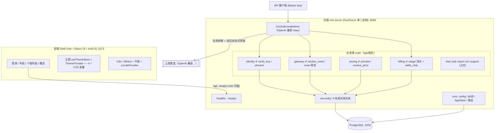
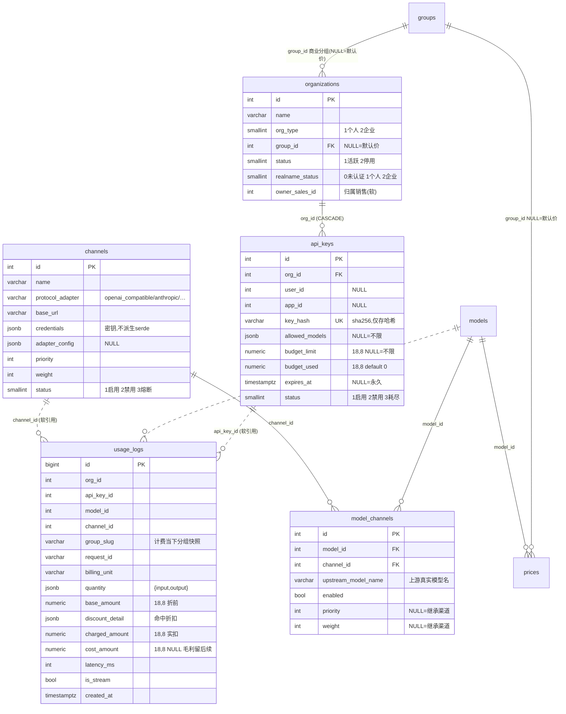
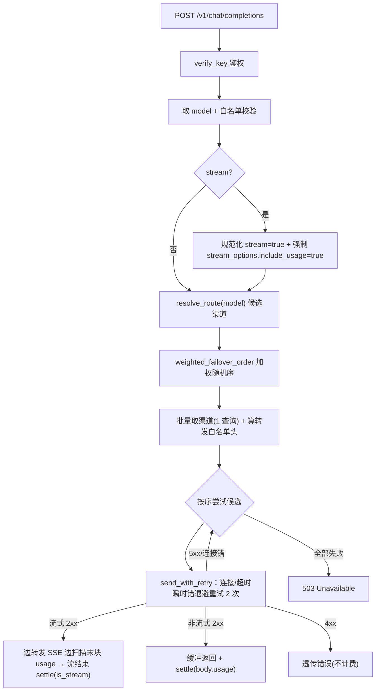
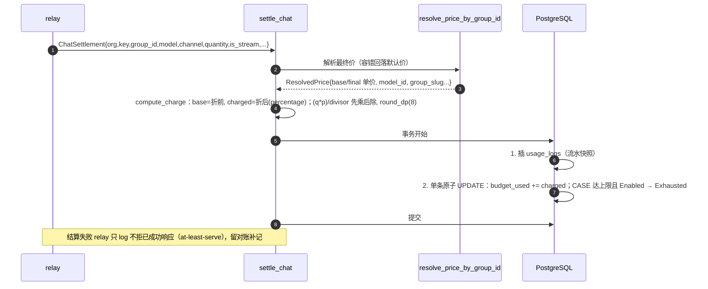

# Rise Router 已实现功能与数据库设计（as-built）

> 版本：v0.4 · 2026-06-14 · 本文记录**已落地的真实实现状态**（与设计蓝图 [data-model.md](./data-model.md)/[architecture.md](./architecture.md) 区分）。表结构取自运行库真实 schema。
>
> v0.4 增量（分支 `feat/m1-admin-crud`）：① 全套**管理台 CRUD**（8 实体 + 共享 admin 守卫）补齐 M1 退出标准的管理面；② **前端管理控制台**（数据驱动 CrudPage + 价格预览页）；③ 同步登记已合并的 **M2 财务**（钱包/订单/对账）端点与表。详见 §9/§12。

## 1. 本阶段已实现概览

| 模块 | 内容 | 位置 | 状态 |
|---|---|---|---|
| M0 脚手架 | Cargo workspace + 10 域 crate + Axum 单二进制 + `/healthz` `/readyz` + SeaORM 迁移 + 前端 Shell | `backend/`、`frontend/shell/` | ✅ main |
| 可配置主题 | 克制专业风、暗色优先+浅色、极光青绿、4 强调色预设、白标、自托管字体 | `frontend/shell/src/theme/` | ✅ main |
| 国际化 i18n | i18next + 中/英 + 语言切换 + AntD/dayjs 联动 + API 错误码映射 | `frontend/shell/src/i18n/` | ✅ main |
| **定价核心** | 五要素解耦：models/prices/discounts + `resolve_price()`（slug 版）/`resolve_price_by_group_id()`（热路径）+ 价格预览 | `backend/crates/{entity,pricing}` | ✅ main |
| **身份与密钥** | organizations + 虚拟密钥 api_keys + `verify_key()`（单 JOIN 鉴权）+ `bearer_token()` + `whoami` | `backend/crates/identity` | ✅ main |
| **网关与路由** | channels + model_channels + `resolve_route()`（路由线）+ `rank_routes`/加权随机序 + `/route` 预览 | `backend/crates/gateway` | ✅ main |
| **relay 转发** | OpenAI 兼容 `/v1/chat/completions`：鉴权→白名单→路由→失败转移→转发；**流式 SSE + 重试退避 + 转发头** | `backend/crates/gateway/src/relay.rs` | ✅ main(非流式) / 🔶 PR(流式) |
| **计费结算** | 同步后扣：`charge`（算费纯函数）+ `settle_chat`（事务：流水+扣预算）+ usage_logs + `/usage` 游标分页 | `backend/crates/billing` | ✅ main |
| **M2 财务** | 钱包（余额/授信/冻结）+ 充值入账 + 充值订单（mock 支付/幂等）+ 应收侧对账（周期聚合 + draft/locked 封账）| `backend/crates/billing` | ✅ main |
| **管理台 CRUD** | 五要素 + 路由 + 身份共 8 实体的增删改查（admin 守卫）：channels/models/model_channels/groups/prices/discounts/organizations/api_keys | `backend/crates/{gateway,pricing,identity}` | ✅ 本片 |
| **前端管理控制台** | 数据驱动 `CrudPage` + 字段描述符（8 实体）+ 价格预览页 + 管理令牌设置；`X-Admin-Token` 通道 | `frontend/shell/src/pages/admin/` | ✅ 本片 |

**MVP 端到端可计费回路已闭合且可视化运营**：建组织→建分组→配渠道/模型/路由→配价/折扣→发密钥（明文一次）→价格预览→调用（relay）→扣费→看流水——全程管理台操作，不需手写 SQL。

## 2. 已实现系统架构图



## 3. MVP 可计费回路（核心流程）

```mermaid
sequenceDiagram
    autonumber
    participant C as 客户端
    participant R as relay /v1/chat/completions
    participant ID as identity.verify_key
    participant GW as gateway.resolve_route
    participant UP as 上游渠道
    participant BL as billing.settle_chat
    participant DB as PostgreSQL
    C->>R: POST (Bearer key, model, messages[, stream])
    R->>ID: verify_key(单 JOIN api_keys⨝organizations)
    ID-->>R: KeyContext{org_id,group_id,allowed_models,...}（状态/过期/预算校验）
    R->>R: 模型白名单 + 流式判定/规范化
    R->>GW: resolve_route(model) → 候选渠道
    R->>R: weighted_failover_order（同优先级加权随机）
    loop 按加权序失败转移（5xx/连接错→下一渠道）
        R->>UP: 转发(模型映射上游名 + 注入渠道 key + 转发白名单头)
        UP-->>R: 2xx（非流式 JSON / 流式 SSE）
    end
    alt 非流式 2xx
        R->>BL: settle(从 body.usage)
    else 流式 2xx
        R-->>C: 边转发 SSE 边扫描末块 usage
        R->>BL: settle(从 SSE usage, is_stream=true)
    end
    BL->>BL: resolve_price_by_group_id → 算 base/charged
    BL->>DB: 事务{ 插 usage_logs; 原子自增 budget_used + CASE 翻 Exhausted }
    R-->>C: 响应（非流式整段 / 流式逐块）
```

## 4. 数据库设计（as-built）

实际建了 **9 张表**（迁移 `000001~000010`，其中 000010 为精度调整）。维度表 PK 为 `integer`；高写入流水表 `usage_logs` PK 为 `bigint`。金额列统一 `numeric(18,8)`（避免极便宜模型微调用 round-to-zero 免费洞）。

### 4.1 ER 图



> 定价五要素另含 `models`/`prices`/`discounts`/`groups`（结构见 v0.1 设计，未变）：`groups`/`models` 不含价格；价格在 `prices`（模型×分组）；折扣在独立 `discounts`。

### 4.2 关键约束与索引

- **凭据安全**：`channels.credentials`、`api_keys.key_hash` 所在实体**不派生 serde**（无法被序列化进响应，杜绝泄露；CRUD 用专用 DTO）。
- **两条独立轴**：`roles`（RBAC，挂 user，待落地）vs `groups`（定价档位，挂 organization）。计费主体是 `organizations`（个人=org-of-one）。
- **usage_logs 只追加**：无外键（软引用，避免删渠道/分组连带删历史账 + 省高频写校验），靠索引：
  - `idx_usage_logs_org_created(org_id, created_at)`、`idx_usage_logs_key_created(api_key_id, created_at)`、`idx_usage_logs_created(created_at)`、`idx_usage_logs_org_id(org_id, id)`（游标分页）。
- **路由索引**：`idx_model_channels_route`、`idx_model_channels_channel_id`；**定价索引**：`idx_prices_lookup(model_id, group_id, valid_from)`。

## 5. 定价解析（resolve_price）

`resolve_price`（slug 版，管理台预览，**严格报错防拼错**）与 `resolve_price_by_group_id`（网关热路径，**容错回落默认价不丢收入**）共用同一 core 解析（所见即所得）；纯函数 `select_price`/`apply_discounts` 8 单测覆盖。

- **选价**：分组专属价 > 默认价（group_id NULL），同档取最新 `version`。
- **折扣**：percentage 并入单价（可叠加相乘 / 不可叠加取最高优先级）；fixed 仅登记（对账期作用账单总额），记入 `discount_detail`。全程 Decimal。

## 6. 网关路由 + relay 转发（流程图）



- **路由线 vs 定价线**：`resolve_route` 走 `models—model_channels—channels`（单 JOIN，内存过滤熔断/禁用）；与定价线仅在 `models` 相交，互不依赖。
- **加权随机**：`weighted_failover_order` 优先级降序分层、层内按权重随机洗牌（负载均衡）；`rank_routes`（确定序）供 `/route` 预览。
- **凭据注入 + 模型映射**：转发时 `body.model` 改为 `upstream_model_name`，`Authorization` 注入渠道 `credentials.key`，透传 `OpenAI-Beta/Organization/Project` 白名单头。
- **流式 SSE**：**强制** `stream_options.include_usage=true`（防客户端 `false` 绕过计费）；`async-stream` 边转发字节边按 `\n` 增量扫描 `data:` 行提取 usage/request_id（关键字预筛 + 游标单次 drain O(N) + 1MB 缓冲防 OOM）；结算由 `SettleGuard`（随流 Drop 触发）保证**正常结束或客户端提前断连都不漏单**；开始吐字节后不再 failover。
- **重试**：仅连接级错误退避重试（POST 非幂等，不重试超时以免重复扣费）。

## 7. 计费结算（settle_chat）



- **同步后扣**：请求路径内、返回前完成；按实际 usage 扣减，放行跨上限那一次，随后翻 Exhausted（后续鉴权即 429）。
- **原子性**：流水 + 扣费同事务；扣费与翻转合并为单条 `CASE WHEN` UPDATE，消除崩溃窗口、省一次 RTT。
- **看流水**：`/api/billing/usage` 按密钥 org 行级隔离（RLS 雏形）+ **游标分页**（`cursor=上页末条 id`，按 id 倒序，主键有序定位、无 offset 深翻页与数据漂移）。

## 8. 前端：可配置主题 + 国际化（设计图）

> 与 v0.1 一致，未变更。4 强调色预设×暗浅=8 组合 + 白标实时换肤 + localStorage 持久化；i18n 四子系统（UI 文案 i18next / 内容 `*_i18n` JSONB / API 错误 code+参数 / Intl 格式化）+ locale 协商。详见 [architecture.md §4.1](./architecture.md)、[i18n.md](./i18n.md)。

## 9. API 端点（已实现）

**核心 / 客户侧（Bearer 密钥或公开）**

| 方法 | 路径 | 说明 |
|---|---|---|
| GET | `/healthz` · `/readyz` | 存活 / 就绪探针 |
| POST | `/v1/chat/completions` | **OpenAI 兼容 relay**：鉴权→路由→失败转移→转发（非流式 + 流式 SSE）+ 同步计费 |
| GET | `/api/identity/whoami` | Bearer 密钥 → 回显鉴权上下文（无密钥字段） |
| GET | `/api/gateway/route?model=` | 路由预览：候选渠道按确定序 |
| GET | `/api/pricing/preview?model=&group=` | 价格预览：base/final 单价 + 折扣明细 + version |
| GET | `/api/billing/usage?limit=&cursor=` | 看流水：本 org 计费明细，游标分页 |
| GET | `/api/billing/wallet` | 看本 org 钱包（余额/授信/冻结/可用）|
| POST/GET | `/api/billing/invoices`（M2 发票片，另分支）| 申请/看发票 |
| GET | `/api/<域>/_ping` | rbac/task/report/crm/support 占位 |

**管理侧（M2 财务，`X-Admin-Token` 守卫）**

| 方法 | 路径 | 说明 |
|---|---|---|
| POST | `/api/billing/recharge` | 手动充值入账 |
| POST/GET | `/api/billing/orders`、POST `…/{id}/confirm` | 充值订单 + mock 支付确认（幂等）|
| POST/GET | `/api/billing/reconciliations`、GET `…/{id}`、POST `…/{id}/lock` | 周期对账生成/查/封账 |

**管理台 CRUD（`X-Admin-Token` 守卫；本片新增）**——每个实体均 `POST`(建) `GET`(列) + `GET/PUT/DELETE /{id}`：

| 基路径 | 实体 | 关键点 |
|---|---|---|
| `/api/gateway/channels` | 渠道 | 凭据脱敏响应（`has_credentials`）；协议族白名单；删除查路由引用 |
| `/api/gateway/models` | 模型目录 | slug 查重；modality/invocation/billing_unit 词表；删除查路由/价引用 |
| `/api/gateway/model-channels` | 路由线 | model/channel FK + 唯一对预检；priority/weight NULL=继承 |
| `/api/pricing/groups` | 商业分组 | slug 查重；删除查 org/价引用 |
| `/api/pricing/prices` | 价格 | billing_unit 派生自模型；**自动定版本号**；unit_prices 非负校验 |
| `/api/pricing/discounts` | 折扣 | scope/kind 白名单；按 scope 预检目标；percentage∈(0,1] |
| `/api/identity/organizations` | 组织 | group_id/owner_sales_id 三态部分更新；删除查 key/钱包/订单引用 |
| `/api/identity/api-keys` | 虚拟密钥 | 生成 `sk-rr-…` 明文**仅回显一次**，库存 sha256；`ApiKeyView` 脱敏 |

## 10. 工程清单

- **crate**：`rise-core`（+ 共享 `admin_guard`）、`rise-entity`（13 表共享实体）、`rise-identity`、`rise-gateway`、`rise-pricing`、`rise-billing`（均已实现，含管理 CRUD）；`rbac/task/report/crm/support` 占位；`rise-server`、`migration`。
- **迁移（14）**：`000001 groups`…`000010 widen_budget_precision`（M1）+ `000011 wallets` / `000012 transactions` / `000013 orders` / `000014 reconciliations`（M2）。
- **测试**：后端 **56 单测**（pricing 16、gateway 18、identity 11、billing 10、core 1）。
- **前端**：`frontend/shell/src/pages/admin/`（`CrudPage` 通用组件 + `resources.ts` 8 实体描述符 + `PricePreview` + `AdminTokenSettings`）；`src/api/admin.ts`（FK option 加载器 + 价格预览）；`tsc` + `vite build` 绿。

## 11. 未实现 / 后续切片

- **RBAC**（roles/permissions + `enforce` + App 权限点注册）——当前管理端点用临时 `X-Admin-Token` 守卫（`rise_core::admin_guard`），RBAC 落地后替换；org 维度折扣 FK。
- **用户登录注册**（users + 手机号短信）——当前前端登录为占位，密钥经管理台发放。
- **管理台增强**：可清空字段（如 api_key 预算/白名单）的 null 语义仅 org 维度支持；字段级 i18n（当前管理表单标签为中文直出）。
- **多模态**：`/v1/tasks` 异步任务子系统（状态机 + 轮询/webhook + artifacts/S3）；渠道成本 → `cost_amount` 毛利。
- relay：流式 usage 块对不设 include_usage 客户端的剥离（当前透传）；协议族适配器（anthropic/gemini/任务式）。

## 12. 管理台 CRUD 与前端控制台（本片）

- **统一守卫**：管理写端点共用 `rise_core::admin_guard`（`X-Admin-Token` 常量时间比较匹配 `RR_ADMIN_TOKEN`，未配置一律 403）；RBAC 落地后整体替换。
- **凭据安全**：`channels.credentials` / `api_keys.key_hash` 实体不派生 serde，CRUD 用专用脱敏 DTO（响应永不含密钥；api_key 明文仅创建时回显一次）。
- **破坏性删除护栏**：FK 为 CASCADE/SET NULL 的实体（渠道/模型/分组/组织）删除前先查下游引用，命中返回 400 引导先清依赖或改用禁用/停用，杜绝静默级联删数据/改计费。
- **五要素解耦不破**：价格走 `prices`（model×group，显式 jsonb 无倍率 + 版本化），折扣走独立 `discounts`，改价=建新版本，不联动其余四要素；管理台「价格预览」与计费热路径复用同一 `resolve_price`。
- **前端**：数据驱动 `CrudPage<ResourceDef>`——一个组件 + 字段描述符渲染全部 8 实体的表格/表单（文本/数字/JSON/枚举/FK 下拉/开关/时间），避免 8 份重复页面。导航分 网关/定价/身份 三组子菜单 + 系统设置（外观 / 管理令牌）。
